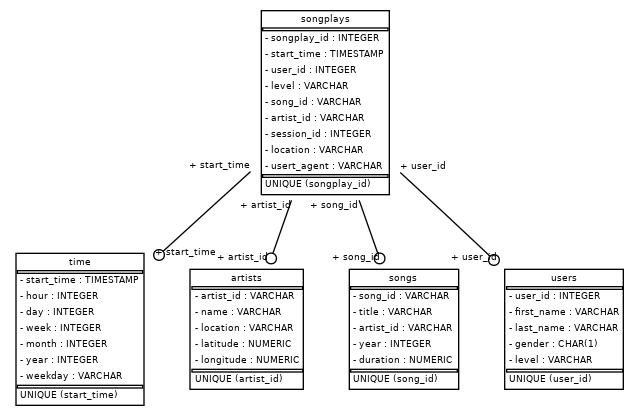

# Sparkify - Postgres Data Modeling (1 Udacity project for Date Enginner nanodegree program)

## Introduction

A startup called Sparkify wants to analyze the data they've been collecting on songs and user activity on their new music streaming app. The analytics team is particularly interested in understanding what songs users are listening to. Currently, they don't have an easy way to query their data, which resides in a directory of JSON logs on user activity on the app, as well as a directory with JSON metadata on the songs in their app.

They'd like a data engineer to create a Postgres database with tables designed to optimize queries on song play analysis, and bring you on the project. Your role is to create a database schema and ETL pipeline for this analysis. You'll be able to test your database and ETL pipeline by running queries given to you by the analytics team from Sparkify and compare your results with their expected results.


## Database purpose

This data modeling has as goal to organize and structure the songs that are lisetineng, it allows to easly query this information using de SQL query languaje

## Database schema design

This database is design to save the Songs, users, artis data, and with this relationship save the songs that are listiening by the users.



Note: This database use Foreign keys with constraints. 

## How to run this project 

### Create DB
```
$ sudo -u postgres psql -c "create role student  with login password 'student';" -W -h 127.0.0.1
$ sudo -u postgres psql -c "alter user student with superuser;" -W -h 127.0.0.1
$ sudo -u postgres createdb sparkifydb -O student -W -h 127.0.0.1
$ sudo -u postgres createdb studentdb -O student -W -h 127.0.0.1
```

### Run scripts
```
pipenv shell
pip install -r requirements.txt
python create_tables.py 
python etl.py
```

## How to develop
```
pipenv shell
jupyter-lab
```

## Generate ER Diagram
```
python generate_schema.py
```